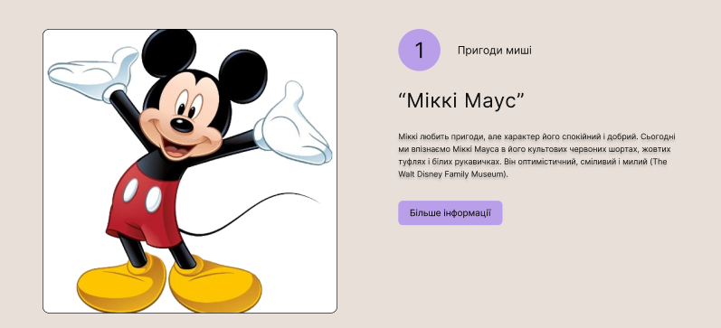
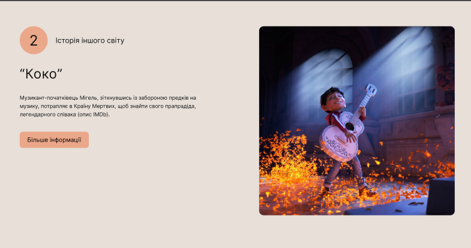
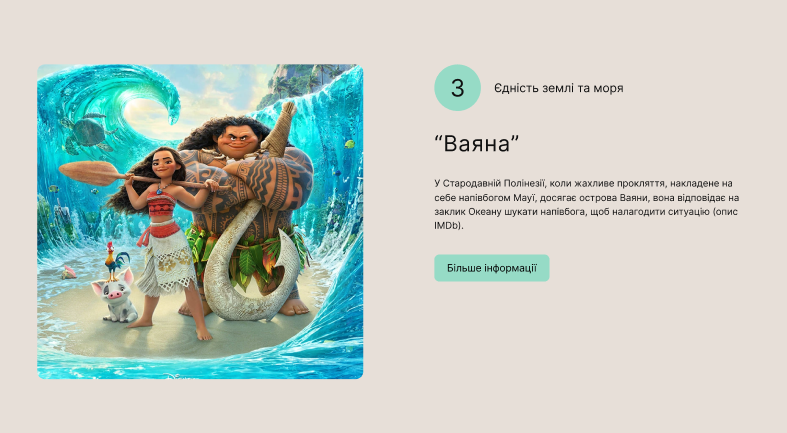

# Cartoons
__This project is not commercial and was made with the aim of gaining experience and reinforcing educational material.__
___
# [Unrealized]
# implemented
1. __version 1.1:__ Made basic marking
2. __version 1.2:__ Start wrote styles
    1. made first and dough sections styles
    2. made third section styles
3. __version 1.2.1__ Fix all bugs with styles and images
## Authors project
* __TheBestikk__ ([Kirill Zakharov](https://github.com/TheBestikk))
## All tools for project

## Contact authors
* __TheBestikk__ ([Kirill Zakharov](https://github.com/TheBestikk))
    * __Telegram:__ https://t.me/TheBestiikkk
    * __Gmail:__ zakharovkirill357@gmail.com
# Screenshoots layout

___
# __Thanks for watching, good luck and see you soon!👋__